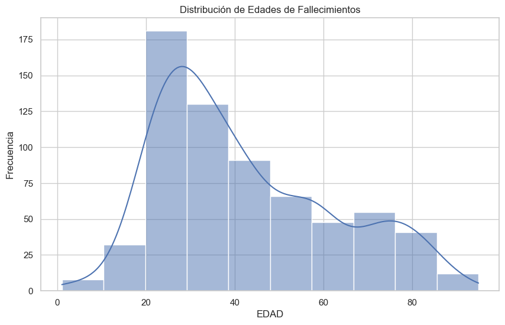
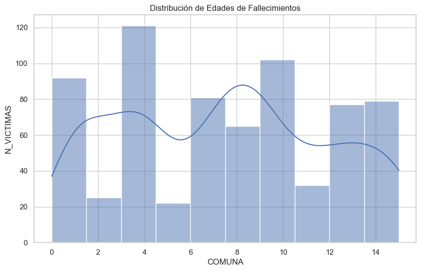
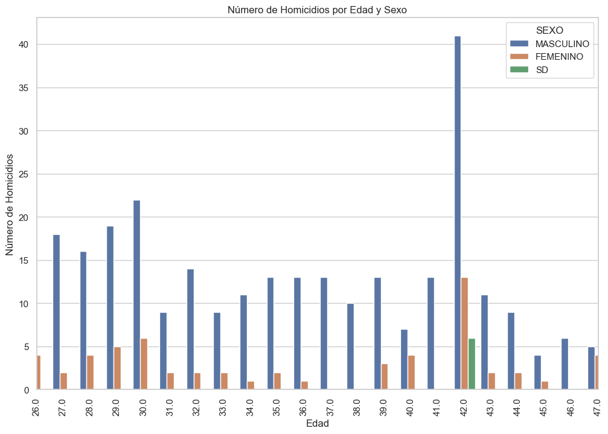

# Proyecto Individual 2: Data Analytics

## Análisis de Siniestros Viales en Buenos Aires

### Tabla de Contenido
1. [Introducción](#introducción)
2. [Los Datos y su Análisis](#los-datos-y-su-análisis)
3. [Dashboard](#dashboard)
4. [Conclusiones](#conclusiones)
5. [KPIs](#kpis)
6. [Visualización](#visualización)
7. [Explicación del Repositorio](#explicación-del-repositorio)

### Introducción

Los siniestros viales, también conocidos como accidentes de tráfico o de tránsito, son eventos que involucran vehículos en las vías públicas. Estos incidentes pueden ser causados por colisiones entre automóviles, motocicletas, bicicletas o peatones, atropellos, choques con objetos fijos o caídas de vehículos, y pueden resultar en daños materiales, lesiones graves o incluso fatales.

Las tasas de mortalidad relacionadas con siniestros viales son un indicador crítico de la seguridad vial en una región. Reducir estas tasas es esencial para mejorar la seguridad vial y proteger la vida de los ciudadanos.

En este proyecto, se nos asigna el rol de analistas de datos para generar información valiosa sobre la evolución de los siniestros viales en la Ciudad de Buenos Aires entre 2016 y 2021. Para ello, utilizaremos un dataset en formato xlsx que contiene dos hojas: hechos y víctimas.

### Los Datos y su Análisis

El análisis de los datos se realiza desde diversas perspectivas, permitiendo tanto análisis cualitativos como cuantitativos. Los datos están divididos de la siguiente manera:

- **HOMICIDIOS_BUENOS_AIRES**: Información sumada de la columna N_VICTIMAS.
- **homicidios_hechos2**: Una fila por hecho con ID único y variables temporales, espaciales y participantes asociadas.
- **homicidos_victimas**: Una fila por víctima con variables de rol, sexo y modo de desplazamiento, vinculadas a HECHOS mediante el ID del hecho.
- **Diccionario de Datos Siniestros Viales**: Información sobre cada variable en las bases de datos.

Después de entender la composición de los datos, se procedió a su carga, limpieza y análisis desde múltiples puntos de vista. Se focalizó en variables útiles como la edad, ilustrada en la siguiente gráfica.

Este histograma muestra las comunas de el numero de las personas involucradas en siniestros viales, concentrándose mayoritariamente entre lA COMUNA 4 y 10.

Otro dato relevante extraído es la distribución de siniestros por mes:

Este histograma indica que los accidentes son más frecuentes entre las 5:00 y las 9:00 de la mañana.

También se analizó la cantidad de victimas y su sexo, observando tendencias a lo largo del tiempo:

Para un análisis completo, consulte el archivo EDA.ipynb.

### Dashboard

Después del EDA, se desarrolló un dashboard para presentar los datos más relevantes a los usuarios.

En esta primera sección, se generan insights sobre la información de los accidentes, incluyendo las horas más frecuentes, las comunas, identificando puntos críticos.

### KPIs

Para este análisis, se propusieron dos KPIs:

1. **Reducir en un 10% la tasa de homicidios en siniestros viales** en CABA en comparación con el semestre anterior.

   La tasa de homicidios en siniestros viales se define como el número de víctimas fatales en accidentes de tránsito por cada 100,000 habitantes en una región durante un período específico.

2. **Reducir en un 7% la cantidad de accidentes mortales de motociclistas** en CABA respecto al año anterior.

   Esto se mide como el número absoluto de accidentes fatales involucrando motociclistas en un período específico.

### Conclusiones

Del análisis se concluyó:

- Las personas entre 20 y 38 años son las más involucradas en siniestros viales.
- El año 2019 mostró una disminución en accidentes viales, con un descenso notable en 2020 debido a la pandemia de COVID-19.
- El ente la comuna 4 y 10 ocurren la mayor cantidad de los accidentes.
- Los siniestros viales tienden a aumentar en el segundo semestre del año.
- El 76.65% de las víctimas son hombres.
- El mayor número de siniestros registrados se presenta mas en motos.
- El mayor número de siniestros registrados se presenta mas en el mes de diciembre y los meses de vacaciones.

### Visualización

Puedes ver el dashboard interactivo descargando el archivo `siniestros_viales_arg.pbix`.

### Explicación del Repositorio

- **Carpeta dataset**: Contiene las bases de datos usadas en el proyecto.
- **Carpeta ETL**: Incluye la carga, limpiesad de los datos.
- **EDA_homicidios.ipynb**: Incluye la carga, transformación y análisis de los datos.
- **Dashboard.pbix**: Contiene el dashboard interactivo.
- **IMG**: Carpeta con las imágenes utilizadas.

Puedes seguir el desarrollo del proyecto en mi LinkedIn.